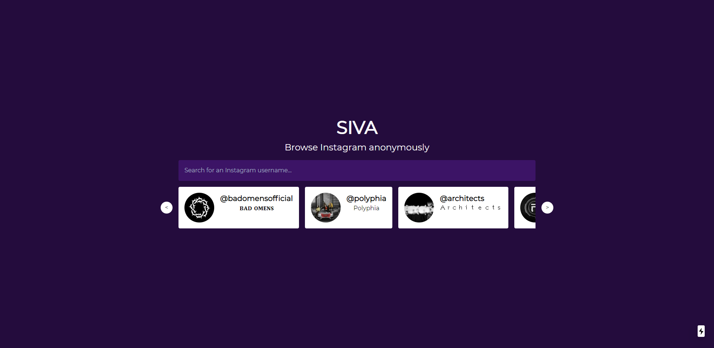
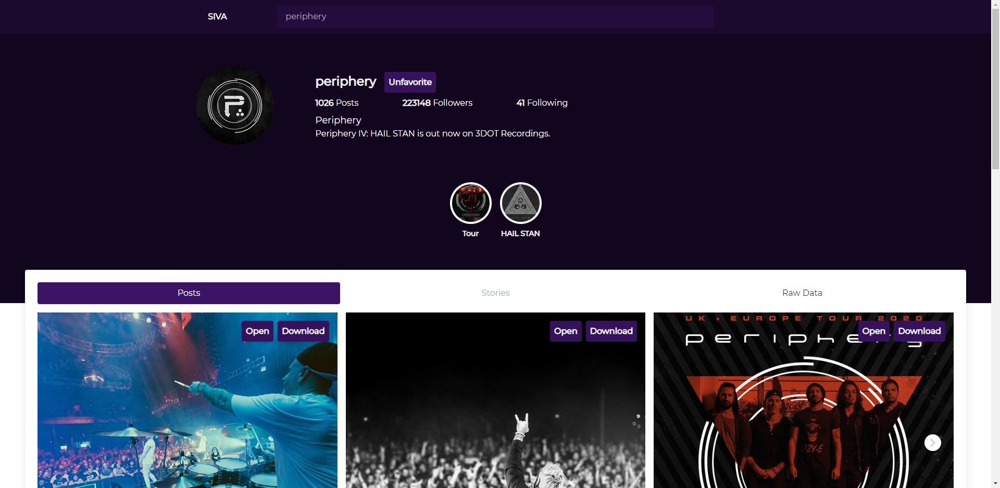

# SIVA

> Open-source app to browse Instagram anonymously. Powered by Next.js

SIVA is a open-source app to browse Instagram profiles anonymously. You can search and view profiles, stories and highlights.

## Developing

- `npm i`

- `npm run dev`

Use the `scripts/login.js` to generate a session file before running the app.

Put the stringified session contents in a env var called `SESSION_STRING`

You can customize how siva pull the session contents in `utils/restoreSession.js`

## Images

## License

MIT